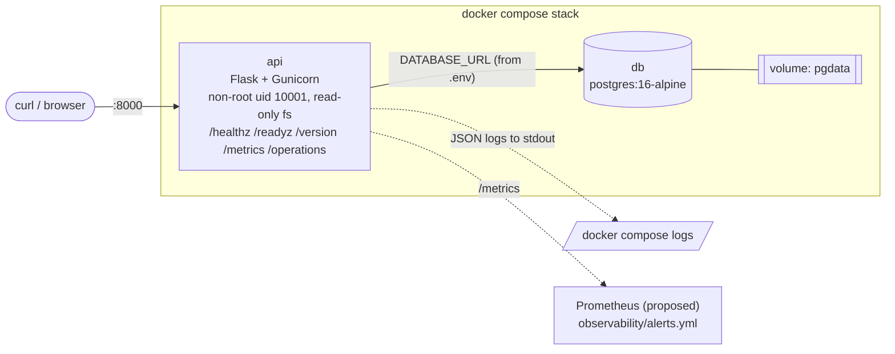
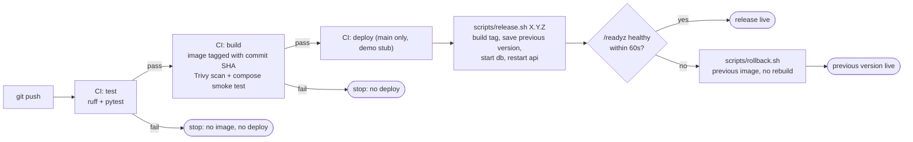

# Architecture and process

## Runtime (local, Docker Compose)

```mermaid
flowchart LR
    user([curl / browser]) -->|":8000"| api
    subgraph compose["docker compose stack"]
        api["api<br/>Flask + Gunicorn<br/>non-root uid 10001, read-only fs<br/>/healthz /readyz /version /metrics /operations"]
        db[("db<br/>postgres:16-alpine")]
        vol[["volume: pgdata"]]
        api -->|"DATABASE_URL (from .env)"| db
        db --- vol
    end
    api -.->|"JSON logs to stdout"| logs[/"docker compose logs"/]
    api -.->|"/metrics"| prom["Prometheus (proposed)<br/>observability/alerts.yml"]
```

## Commit to release

```mermaid
flowchart LR
    dev["git push"] --> test["CI: test<br/>ruff + pytest"]
    test -->|pass| build["CI: build<br/>image tagged with commit SHA<br/>Trivy scan + compose smoke test"]
    test -->|fail| stop1(["stop: no image, no deploy"])
    build -->|pass| deploy["CI: deploy (main only, demo stub)"]
    build -->|fail| stop2(["stop: no deploy"])
    deploy --> rel["scripts/release.sh X.Y.Z<br/>build tag, save previous version,<br/>start db, restart api"]
    rel --> chk{"/readyz healthy<br/>within 60s?"}
    chk -->|yes| live(["release live"])
    chk -->|no| rb["scripts/rollback.sh<br/>previous image, no rebuild"]
    rb --> live2(["previous version live"])
```
